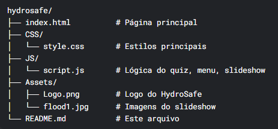

HydroSafe - Sistema de Alerta de Enchentes
🚀 Projeto desenvolvido para a FIAP Global Solution 2025.1

📌 Visão Geral
O HydroSafe é uma solução tecnológica para prevenção e alerta de enchentes, utilizando sensores IoT, inteligência artificial e um aplicativo móvel para fornecer alertas precoces a comunidades em risco.

🔗 Link do Projeto: https://github.com/HyydroSafe/HydroSafe_.git

🎯 Objetivo
Reduzir mortes e prejuízos econômicos causados por enchentes no Brasil, oferecendo:
✅ Alertas com 48h de antecedência
✅ Monitoramento em tempo real de rios e bacias hidrográficas
✅ Comunicação direta com Defesa Civil e moradores

🛠 Tecnologias Utilizadas
Tecnologia	& Função
- HTML5 & CSS3	- Estrutura e design da landing page
- JavaScript (ES6+)	- Interatividade (quiz, slideshow, menu)
- Python	-Backend para análise de dados de enchentes
- IoT (Arduino)	- Sensores de nível de água em rios
- Git & GitHub	- Versionamento e colaboração

📋 Funcionalidades Implementadas
1. Landing Page Responsiva
✔️ 6 seções completas (Problema, Tecnologia, Objetivos, Público-Alvo, Solução, Benefícios)
✔️ Slideshow automático com 3 imagens
✔️ Menu hambúrguer para mobile (oculta opções em telas pequenas)

2. Quiz Interativo
✔️ 10 perguntas sobre enchentes e prevenção
✔️ Resultado com porcentagem de acertos

3. Troca de Temas (Cores)
✔️ 3 opções de cores de fundo (claro, escuro, azul)

🚀 Como Executar o Projeto
Clone o repositório:

bash
git clone https://github.com/seu-usuario/hydrosafe.git

Abra o arquivo principal:

bash
cd hydrosafe
open index.html  # Ou arraste o arquivo para o navegador

Para desenvolvimento:
 - Use o Live Server (VS Code) para atualização em tempo real.

📌 Requisitos da FIAP Global Solution
Front-end Design (Atendidos ✅)
✔️ Landing page com 6 seções
✔️ Menu de navegação funcional
✔️ Design responsivo (mobile e desktop)

WebDev (Atendidos ✅)
✔️ Slideshow com 3 imagens
✔️ Quiz com 10 perguntas
✔️ Menu hambúrguer para mobile
✔️ Troca de cores de fundo

📌 Estrutura de Arquivos

Atualizado em: 29/Junho de 2025
